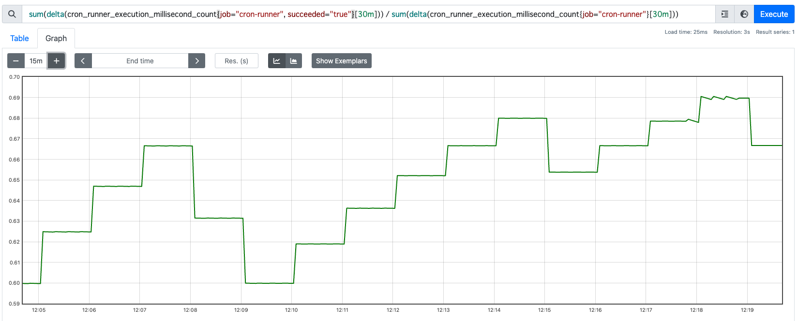
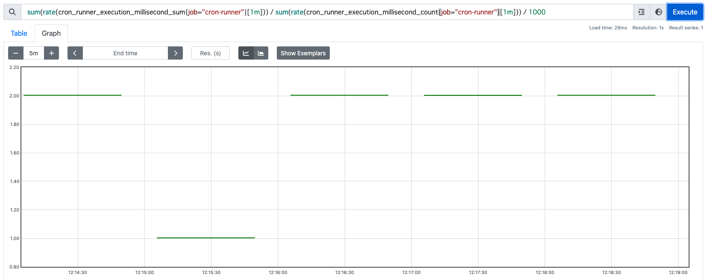

# cron-runner

cron-runner is run command periodically and expose Prometheus metrics for execution results.

## Usage

```
Usage:
  cron-runner [flags] -- COMMAND [args...]

Flags:
  -c, --cron-expression string     Cron schedule expression.
  -h, --help                       help for cron-runner
      --ignore-exit-code           Ignore exit code. Always succeed unless regex match fails.
  -n, --job-name string            Job name for the label of exposed metrics
      --metrics-bind-addr string   bind address of HTTP server to expose metrics (default "0.0.0.0:9091")
  -o, --output string              Output file for the result of command (default "/dev/stdout")
      --regex string               If regex does not matched to stdout and stderr, command is regarded as failure.
      --timeout-millisecond int    Timezone for cron expression. defaults to local. (default 10000)
      --timezone string            Timezone for cron expression. defaults to local.
```

* example: run `script.sh` every 30 minutes

```bash
cron-runner -n "job-name" -c "* * * * */30" -- script.sh
```

## Expose Prometheus metrics

cron-runner exposes Prometheus metrics to collect the execution time and the number of execution.

* example. success rate in the last 30 minutes (--job-name=`cron-runner`)

```promql
sum(delta(cron_runner_execution_millisecond_count{job="cron-runner", succeeded="true"}[30m])) / sum(delta(cron_runner_execution_millisecond_count{job="cron-runner"}[30m]))
```



* example. avarage execution time in the last 1 minute (--job-name=`cron-runner`)

```promql
sum(delta(cron_runner_execution_millisecond_sum{job="cron-runner"}[1m])) / sum(delta(cron_runner_execution_millisecond_count{job="cron-runner"}[1m])) / 1000
```



## License

[MIT](./LICENSE)
